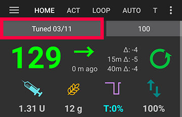
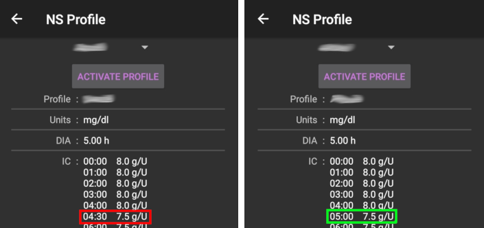
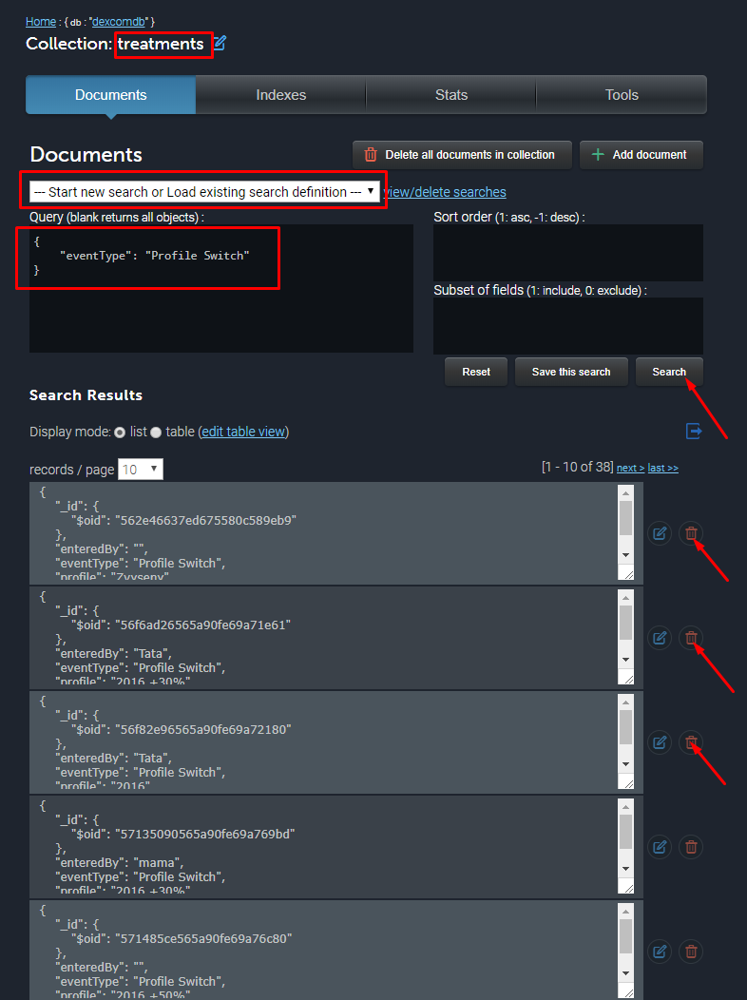

# Profile switch

Documentation about profiles in general can be found at [Config Builder - profile](../Configuration/Config-Builder#profile).

On starting your AAPS and selecting your profile, you will need to do a "Profile switch" event with zero duration (explained later). By doing this AAPS starts tracking history of profiles and every new profile change requires another "Profile switch" even when you change content of the profile in NS. Updated profile is pushed to AAPS immediately, but you need to switch the same profile again to start using these changes.

Internally AAPS creates snapshot of profile with start date and duration and is using it within selected period.

* Duration of zero means infinite. Such profile is valid until new "Profile switch".
* Duration of x minutes means x minutes use of this profile. After that duration the profile is switched back to the previous valid "Profile switch".

If you edited your profile inside the "local profile" tab you can activate the profile there which makes an implicit profile switch too.

To do a profile switch long-press on the name of your profile ("Tuned 03/11" in the picture below) on the homescreen of AndroidAPS.

Within the "profile switch" you can choose two additional changes which used to be part of the Circadian Percentage Profile:

## Percentage

* This applies the same percentage to all parameters. 
* If you set it to 130% (meaning you are 30% more insulin resistant), it will raise the basal rate by 30%. It will also lower the ISF and IC accordingly (divide by 1.3 in this example).
  
  

* It will be sent to the pump and then be the default basal rate.

* The loop algorithm (open or closed) will continue to work on top of the selected percentage profile. So, for example separate percentage profiles can be set up for different stages of the hormone cycle.

## Time shift

* This moves everything round the clock by the number of hours entered. 
* So, for example, when working night shifts change the number of hours to how much later/earlier you go to bed or wake up.
* It is always a question of which hour's profile settings should replace the settings of the current time. This time must be shifted by x hours. So be aware of the directions as described in the following example: 
  * Current time: 12:00
  * **Positive** time shift 
    * 2:00 **+10 h** -> 12:00
    * Settings from 2:00 will be used instead of the settings normally used at 12:00 because of the positive time shift.
  * **Negative** time shift 
    * 22:00 **-10 h** -> 12:00
    * Settings from 22:00 (10 pm) will be used instead of the settings normally used at 12:00 because of the negative time shift.

This mechanism of taking snapshots of the profile allows a much more precise calculations of the past and the possibility to track profile changes.

## Troubleshooting Profile Errors

### 'Invalid profile' / 'Basal Profile not aligned to hours'

* These error messages will appear if you have any basal rates or I:C rates not on the hour. (DanaR and DanaRS pumps do not support changes on the half hour for example.)
  
  

* Remember / note down date and time shown in the error message (26/07/2019 5:45 pm in screenshot above).

* Go to Treatments tab
* Select ProfileSwitch
* Scroll until you find date and time from error message.
* Use remove function.
* Sometimes there is not only one faulty profile switch. In this case remove also the others.
  
  

Alternatively you can delete the profile switch directly in mLab as described below.

### 'Received profile switch from NS but profile does not exist locally'

* The requested profile was not synced correctly from Nightscout.
* Follow instructions from above to delete the profile switch

Alternatively you can delete the profile switch directly in mLab:

* Go to your mlab collection
* Search in the treatments for profile switch
* Delete the profile switch with date and time that was mentioned in the error message. 

### 'DIA 3hr too short'

* Error message will appear if your duration of insulin action in your profile is listed at a value that AndroidAPS doesn't believe will be accurate. 
* Read about [selecting the right DIA](https://www.diabettech.com/insulin/why-we-are-regularly-wrong-in-the-duration-of-insulin-action-dia-times-we-use-and-why-it-matters/), and edit it in your profile then do a [Profile Switch](../Usage/Profiles) to continue.